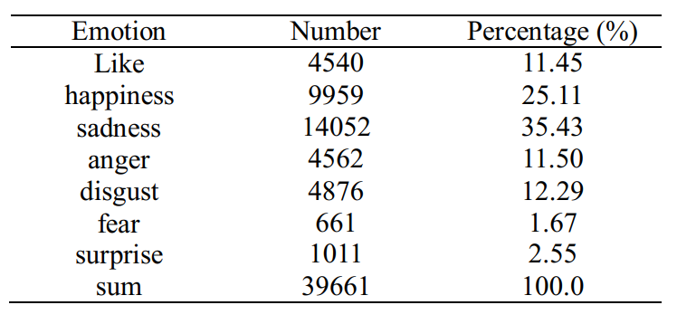

# CLUEEmotion2020
CLUE Emotion Analysis Dataset 情感分析数据集
# Data Description
This dataset in data directory is emotion analysis corpus, with each sample annotated with one emotion label. The label set is *like, happiness, sadness, anger, disgust, fear and surprise*. 

This dataset is from the following paper: 

```Minglei Li, Yunfei Long, Qin Lu, and Wenjie Li. “Emotion Corpus Construction Based on Selection from Hashtags.” In Proceedings of International Conference on Language Resources and Evaluation (LREC). Portorož, Slovenia, 2016```

The corpus statistics and lable distribution are as follows:



The train, valid and test set is split by the ratio of 8:1:1 and encoded in UTF-8.

# Baseline results

Test results of different classification models on this dataset. 

| Models    | Accuracy | Parameters                         |
| --------- | -------- | ---------------------------------- |
| BERT-base | 60.7%    | Epoch 3, batch 32, max_seq_len 128 |

# Reproduce the results

The code is based on the original [CLUE source code](https://github.com/CLUEbenchmark/CLUE), which is based on the original Google BERT code, and the pre-trained language model is [BERT Base Chinese version](https://storage.googleapis.com/bert_models/2018_11_03/chinese_L-12_H-768_A-12.zip). 


## Env

```
tensorflow 1.12
```


## Run command

```
cd models/bert
./run_classifier_emotion.sh
```


